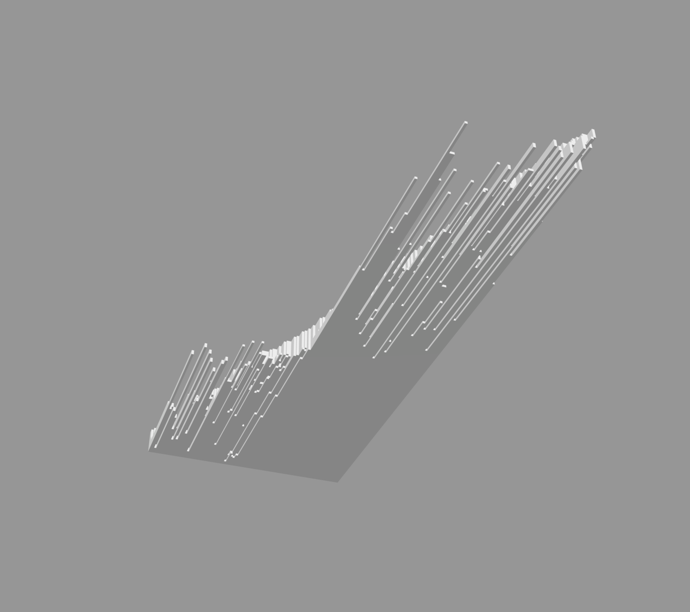
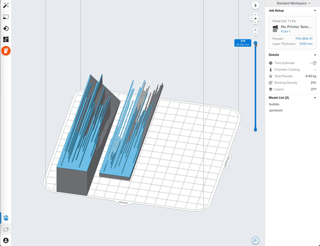

# 3D Sorting Visualization

The goal of this project is to generate 3D-printable visualizations of common sorting algorithms. 

This is accomplished by:
 - Instrument various sorting algorithms to give a snapshot of their internal state over time.
 - For each snapshot, make consecutive prisms with height corresponding to the value of the given element.
 - Convert prisms to triangles.
 - Write triangles to 3D a geometry file (`.stl` :yuck:).

> Slicing the 3D object shows the progression of the sorting algorithms over time.
